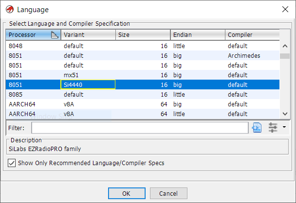

# Ghidra tooling

* [Si4440 process variant](#si4440-processor-variant)
* [EZRadioPRO importer](#ezradiopro-importer)
* [Radare2 importer](#radare2-importer)

This tooling was tested with Ghidra 9.2.

## Si4440 processor variant

The EZRadioPRO runs on an 8051 core that is slightly different from the standard 8051 supported by Ghidra. We created a custom 8051 variant Si4440 to ease reverse engineering of EZRadioPRO firmware:

- Code and external memory share the same 16 bit address space (RAM)
- `MOVX @Ri` uses SFR `XPAGE` to determine MSB of 16 bit address (hard-coded to `0x5000`)
- Only 1 memory mapped register bank to free INTMEM used for variables
- Translate addressing of memory mapped register bank to registers R0-R7 for better decompilation results
- Removed 8051 SFR's not supported by Si4440
- Memory mapped SFR bits for A, B, IE, IP and PSW
- Added entry points for reset vector, interrupt vectors and boot loader

To add the Si4440 variant to your Ghidra installation, copy the contents of the folder [`ghidra/8051`](8051) into

`{ghidra-root}/Ghidra/Processors/8051/data/languages`

This will replace 2 existing files (`8051.ldefs`, `8051_main.sinc`) and add 3 new files. 

After the next restart of Ghidra, Si4440 will be available as variant of the 8051 processor:

As this processor has a flat 16 bit address space, we recommend using full 64 KB dumps of the CODE or XMEM address spaces for firmware analysis.

## EZRadioPRO importer

The Python script [EZRadioPROimport.py](EZRadioPROimport.py) is a Ghidra plugin to import EZRadioPRO registers into a Ghidra program. It extracts [data hidden in Silabs WDS](../docs/wds-xml-docs.md), which includes register addresses and names.

For each register the script
- creates a label
- adds plate comment documenting register fields
- if applicable creates enum 
- assigns byte or enum data type

To add this script to your Ghidra installation, copy `EZRadioPROimport.py` into `{USER_HOME}/ghidra_scripts`.

The script will show up in the Script Manager under the category `Silabs`. Or simply filter for `ezradio` to locate the script.

When running the script, you will be prompted to locate `NewWDS.exe`. After reading the file, you are prompted to select the Silabs part number and revision.

Note:
- it's recommended to use the 8051 Si4440 processor variant
- this script will replace existing labels
- this script is designed to be run repeatedly

Future versions of this script may import additional data. 

## Radare2 importer

The Python script [r2import.py](r2import.py) is a Ghidra plugin to import symbols, functions and comments from [r2 scripts](../radare2).

This script will:
- rename existing functions if their name starts with `FUN_`
- create missing functions, disassembling code if necessary
- rename existing labels if their name start with `DAT_`
- create missing labels
- import EOL comments

This script only supports a very small subset of commands as used in [r2 scripts created for this project](../radare2). It is NOT a generic importer for radare2 scripts.

To add this script to your Ghidra installation, copy `r2import.py` into `{USER_HOME}/ghidra_scripts`.
